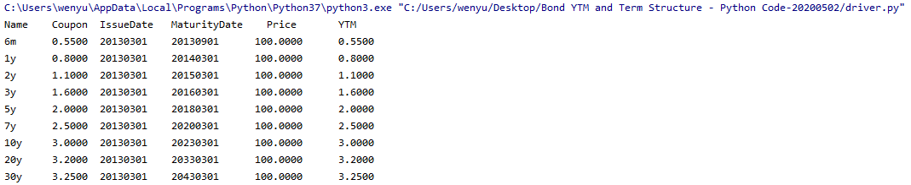
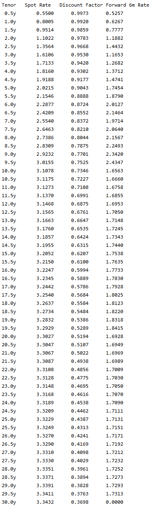

# quantitative_analysis
1. CallAuction\
Call auction file simulates auction process at stock market opening.\
https://www.investopedia.com/terms/c/call-auction.asp

2. Bond Term Structure\
Term structure of interest rates, commonly known as the yield curve, depicts the interest rates of similar quality bonds at different maturities.\
https://www.investopedia.com/terms/t/termstructure.asp#:~:text=Essentially%2C%20term%20structure%20of%20interest,current%20state%20of%20an%20economy.

