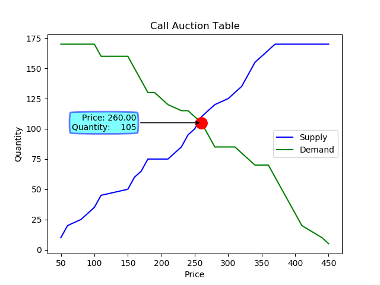
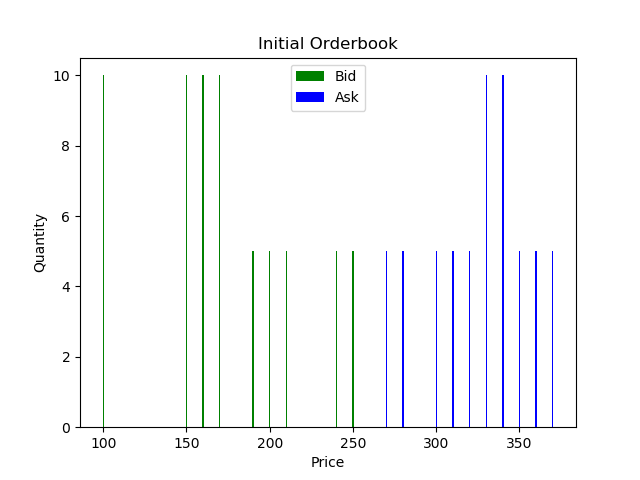
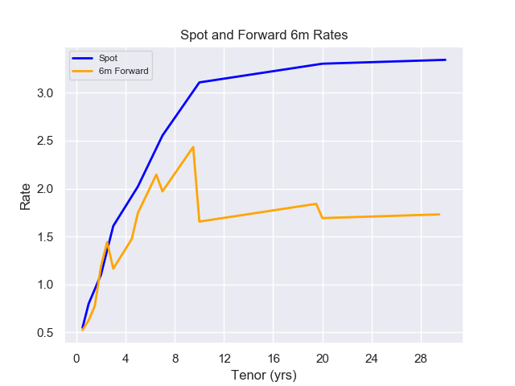
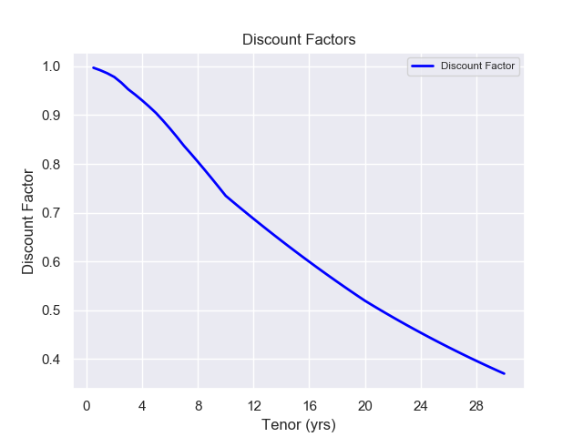
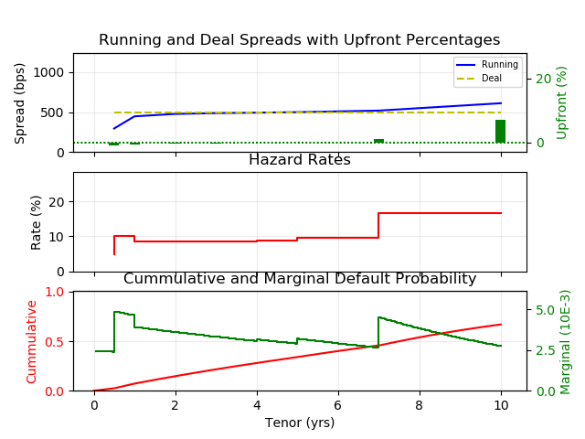
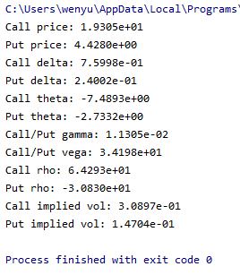
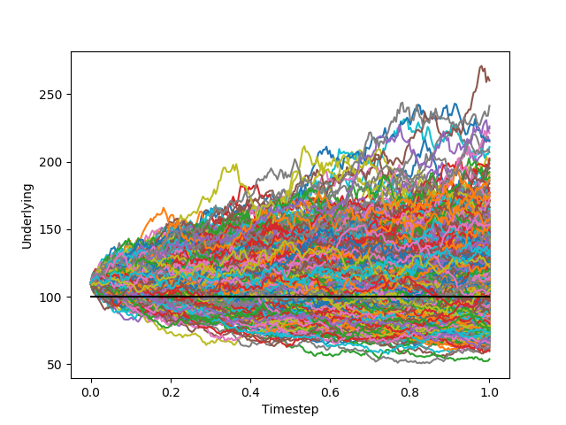

# quantitative_analysis
1. CallAuction\
Call auction file simulates auction process at stock market opening.\
https://www.investopedia.com/terms/c/call-auction.asp

2. Bond Term Structure\
Term structure of interest rates, commonly known as the yield curve, depicts the interest rates of similar quality bonds at different maturities.\
https://www.investopedia.com/terms/t/termstructure.asp#:~:text=Essentially%2C%20term%20structure%20of%20interest,current%20state%20of%20an%20economy.

3. Credit Default Swap Term Structure\
A credit default swap (CDS) is a financial derivative or contract that allows an investor to "swap" or offset his or her credit risk with that of another investor.\ The term structure of CDS spreads reflects the shape of the conditional risk-neutral default probability over different time horizons. Under structural models of credit risk, default is value based, and typically results from a decline in the value of operational cash flows.\
https://www.investopedia.com/terms/c/creditdefaultswap.asp
https://www.sciencedirect.com/science/article/abs/pii/S0927539815000055#:~:text=The%20term%20structure%20of%20CDS%20spreads%20reflects%20the%20shape%20of,value%20of%20operational%20cash%20flows.

4.1 Black Scholes Option Pricing Model\
The Black Scholes model, also known as the Black-Scholes-Merton (BSM) model, is a mathematical model for pricing an options contract.\
https://www.investopedia.com/terms/b/blackscholes.asp#:~:text=Also%20called%20Black%2DScholes%2DMerton,to%20expiration%20and%20expected%20volatility.

4.2 Monte Carlo Option Pricing Chart
In mathematical finance, a Monte Carlo option model uses Monte Carlo methods to calculate the value of an option with multiple sources of uncertainty or with complicated features.\
https://medium.com/swlh/option-pricing-using-monte-carlo-simulations-41d9e4ad95f6

